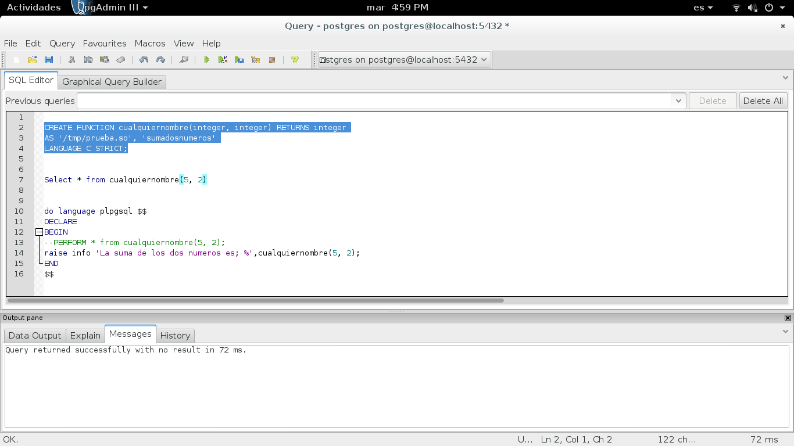
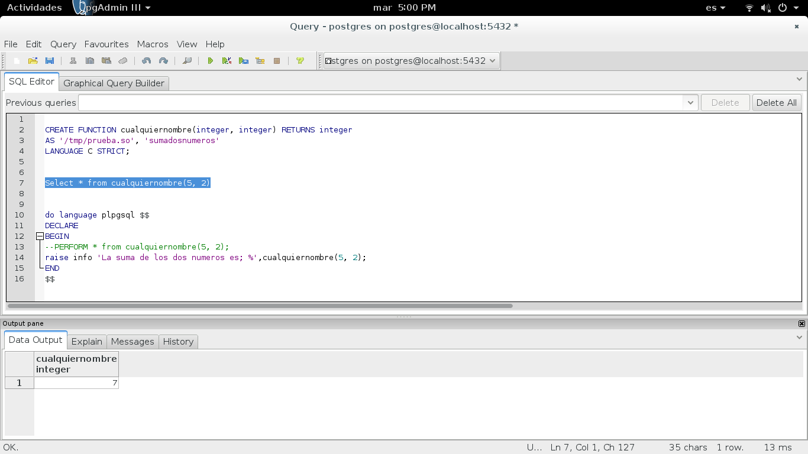
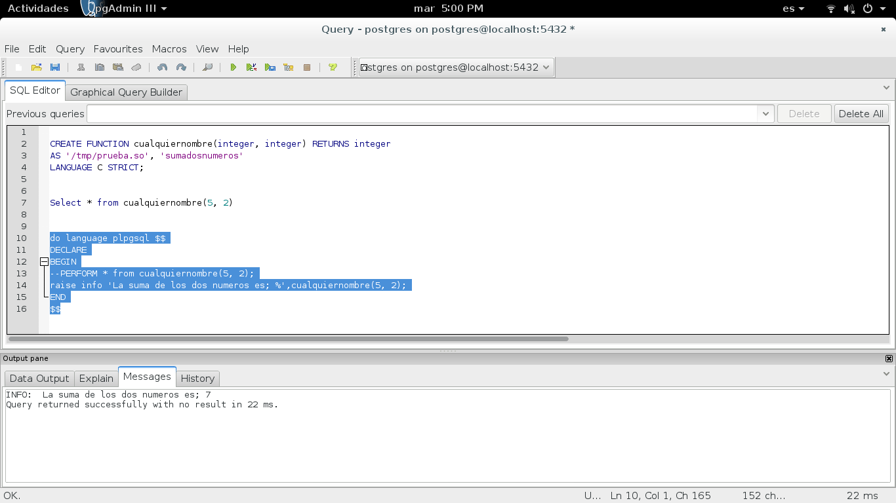

Crear un modulo en lenguaje C para Postgresql
==============================================================
Hay una funcionalidad desconocida para muchos de nosotros de POSTGRES, que nos permite crear codigo y compilarlo en lenguaje C, funciones propias definidas en lenguajes como C o C++ y utilizarlas directamente en el motor de postgres, con todas las ventajas de performance que esto sugiere.

Las funciones definidas por el usuario pueden ser escritos en C (o un lenguaje que pueda ser compatible con C, como C ++). Tales funciones se compilan en los objetos, se pueden cargar dinámicamente (también llamado bibliotecas compartidas) y se cargan por el servidor bajo demanda. La función de la carga dinámica es lo que distingue a las funciones del lenguaje C "" de funciones "internas" - las convenciones de codificación reales son esencialmente los mismos para ambos. (Por lo tanto, la biblioteca de funciones de patrón interno es una fuente rica en ejemplos de funciones definidas por el usuario C-codificación.)

https://www.postgresql.org/docs/9.4/static/xfunc-c.html

Vamos a crear un programa .c que llame las librerias o header requeridas de postgres y llame nuestro header donde estaran nuestras funciones personalizadas.

Estos header siempre deben estar "postgres.h" y "fmgr.h" y También es importante la invocación de la macro PG_MODULE_MAGIC

primero instalamos las librerias de desarrollo de la version de postgres que requerimos::

	# apt-get install postgresql-server-dev-9.4

creamos nuestro programa en lenguaje C.::

	vi prueba.c

	#include<postgres.h>
	#include<fmgr.h>
	#include"/tmp/myheader.h"

	#ifdef PG_MODULE_MAGIC
	PG_MODULE_MAGIC;
	#endif

Creamos nuestro header con nuestra funcion.::

	vi myheader.h

	int sumadosnumeros(int f, int s){
		return f+s;
	}

Ahora compilamos para crear nuestro modulo compatible con postgresql::

	$ gcc -fpic -I/usr/include/postgresql/9.4/server/ -shared -o prueba.so prueba.c

Listo ahora probar en pgadminIII. Creamos la funcion en pgadminIII, Imagen 1.::
	CREATE FUNCTION cualquiernombre(integer, integer) RETURNS integer
	AS '/tmp/prueba.so', 'sumadosnumeros'
	LANGUAGE C STRICT;

Solo resta llamar la funcion y ver el resultado esperado. Imagen 2.::
	Select * from cualquiernombre(5, 2)

Tambien se puede correr en un script de plpgsql. Imagen 3.::
	do language plpgsql $$
	DECLARE
	BEGIN
	--PERFORM * from cualquiernombre(5, 2);
	raise info 'La suma de los dos numeros es; %',cualquiernombre(5, 2);
	END
	$$

Imagen 1.

Imagen 2.

Imagen 3.

